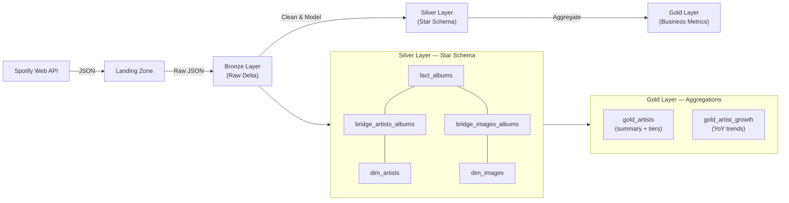
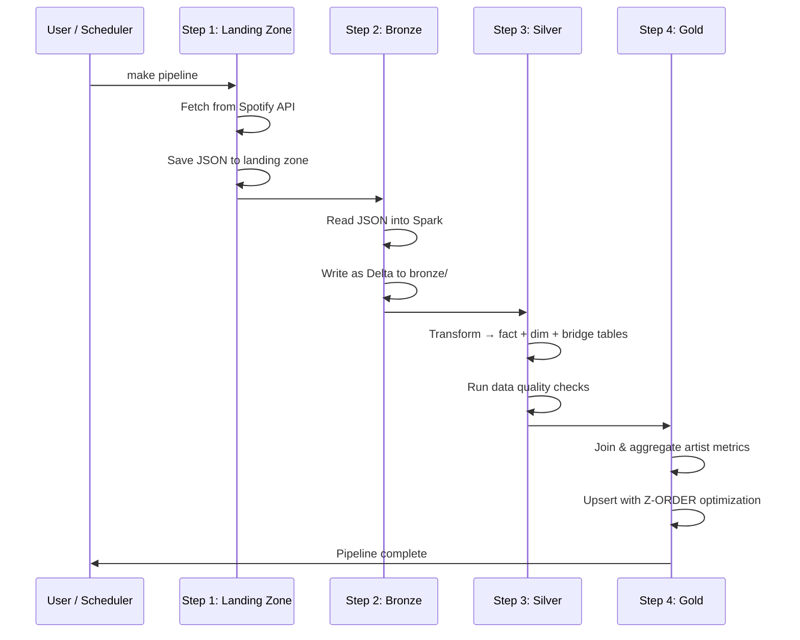

# Architecture

```mermaid
flowchart LR
    API["Spotify Web API"] -->|JSON| LZ["Landing Zone"]
    LZ -->|Raw JSON| B["Bronze Layer\n(Raw Delta)"]
    B -->|Clean & Model| S["Silver Layer\n(Star Schema)"]
    S -->|Aggregate| G["Gold Layer\n(Business Metrics)"]

    subgraph Silver["Silver Layer — Star Schema"]
        FA["fact_albums"]
        DA["dim_artists"]
        DI["dim_images"]
        BA["bridge_artists_albums"]
        BI["bridge_images_albums"]

        FA --- BA --- DA
        FA --- BI --- DI
    end

    subgraph Gold["Gold Layer — Aggregations"]
        GAS["gold_artists\n(summary + tiers)"]
        GAG["gold_artist_growth\n(YoY trends)"]
    end

    B --> Silver
    Silver --> Gold
```

```mermaid
sequenceDiagram
    participant U as User / Scheduler
    participant S1 as Step 1: Landing Zone
    participant S2 as Step 2: Bronze
    participant S3 as Step 3: Silver
    participant S4 as Step 4: Gold

    U->>S1: make pipeline
    S1->>S1: Fetch from Spotify API
    S1->>S1: Save JSON to landing zone
    S1->>S2: 
    S2->>S2: Read JSON into Spark
    S2->>S2: Write as Delta to bronze/
    S2->>S3: 
    S3->>S3: Transform → fact + dim + bridge tables
    S3->>S3: Run data quality checks
    S3->>S4: 
    S4->>S4: Join & aggregate artist metrics
    S4->>S4: Upsert with Z-ORDER optimization
    S4->>U: Pipeline complete
```
